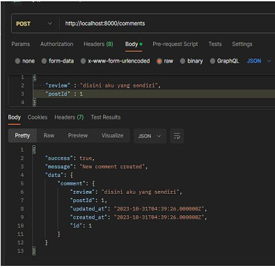
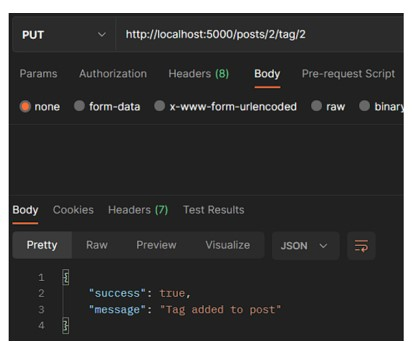

MODEL, CONTROLLER DAN REQUEST RESPONSE HANDLER
------------------------------------------------
Langkah 1) Buat database dengan nama "lumenpost" dan atur konfigurasi database di file .env.
Aktifkan library bawaan Lumen dalam file app.php, dan lakukan generate file migration.
Setelah itu, ubah fungsi up() di file "create_posts_table," "create_comments_table,"
"create_tags_table," dan "create_post_tag_table" sesuai struktur database. Terakhir,
jalankan perintah "php artisan migrate" untuk migrasi database, dan Anda dapat melihat
hasilnya melalui phpMyAdmin.

Langkah 2) Buatlah file dengan nama "Post.php" , "Comment.php" dan juga file "Tag.php" di dalam
direktori Models.

Langkah 3) Tambahkan metode "comments()" di dalam file "Post.php". Selanjutnya, tambahkan
metode "post()" dan atribut "postId" ke dalam $fillable pada file "Comment.php." Setelah
itu, buat file "PostController.php" di dalam direktori "app>Http>Controllers," dan juga
buat file "CommentController.php" di direktori yang sama. Selanjutnya, tambahkan prefix
"posts" dan "comments" ke dalam file "routes/web.php". Setelah itu, buat satu posting
yang berisi konten "disana engkau berdua" menggunakan Postman dengan metode POST,
dan juga buat satu komentar yang berisi ulasan "disini aku yang sendiri" dan postId "1"
menggunakan Postman dengan metode POST. Terakhir, tampilkan posting dengan id "1"
menggunakan Postman dengan metode GET.

Buatlah satu post menggunakan Postman

Buatlah satu comment menggunakan Postman

Tampilkan post menggunakan Postman

Langkah 4) Tambahkan metode "tags()" di dalam file "Post.php". Selanjutnya, pada file "Tag.php",
tambahkan metode "posts()" untuk mendapatkan semua posting terkait dengan tag
tersebut. Buat file "TagController.php" di direktori "app>Http>Controllers" untuk
mengelola operasi terkait tag. Di dalam "PostController.php," tambahkan metode
"addTag" untuk menambahkan tag ke posting dan respons yang mengembalikan daftar tag
pada posting tersebut.
Selanjutnya, pada file "routes/web.php", tambahkan prefix "posts" untuk mengelola rute
terkait posting. Kemudian, menggunakan Postman dengan metode POST, buat satu tag
dengan nama "jadul". Setelah itu, menggunakan metode PUT, tambahkan tag "jadul" ke
dalam posting "disana engkau berdua".
Selanjutnya, gunakan metode GET pada Postman untuk menampilkan detail dari posting
"disana engkau berdua" dan pastikan tag "jadul" terhubung dengan posting tersebut.
Buat posting baru dengan konten "tanpamu apa artinya" menggunakan Postman dengan
metode POST. Setelah itu, menggunakan metode PUT, tambahkan tag "jadul" ke dalam
posting "tanpamu apa artinya". Selanjutnya, buat tag baru dengan nama "lagu"
menggunakan metode POST, dan menggunakan metode PUT, tambahkan tag "lagu" ke
dalam posting "tanpamu apa artinya".
Terakhir, menggunakan Postman dengan metode GET, tampilkan detail dari posting
pertama ("disana engkau berdua") dan posting kedua ("tanpamu apa artinya") untuk
memastikan semua perubahan telah diimplementasikan.

Buatlah satu tag menggunakan Postman

 Tambahkan tag “jadul” pada post “disana engkau berdua”

Tampilkan post “disana engkau berdua” menggunakan Postman

Buatlah postingan “tanpamu apa artinya” menggunakan Postman

Tambahkan tag “jadul” pada postingan “tanpamu apa artinya”

 Buatlah tag “lagu” menggunakan Postman

Tambahkan tag “lagu” pada postingan “tanpamu apa artinya”

Tampilkan post pertama

 Tampilkan post kedua

Langkah 6) Lakukan perubahan summary pada buku “No Longer Human” menjadi “Buku
yang bagus (<NAMA>,<NIM>) dengan melakukan klik “Edit Document”
(berlambang pensil), mengisi nilai summary yang baru, dan melakukan klik
“Update”

Langkah 7) Lakukan penghapusan pada buku “I Am a Cat” dengan melakukan klik
“Remove Document” (berlambang tong sampah) dan melakukan klik “Delete”

MongoDB SHELL
------------------------------------------------
Langkah 1) Lakukan koneksi ke MongoDB server dengan menjalankan command mongosh bagi yang
menggunakan terminal build in OS sehingga tampilan terminal kalian menjadi seperti
berikut.

Langkah 2) Mencoba melihat list database yang ada di server dengan menjalankan command show
dbs
Untuk berpindah ke database “bookstore” gunakan command use bookstore , kalian
dapatmemastikan telah berpindah ke database yang benar dengan melihat tulisan sebelum
tanda “>”

Langkah 3) Lakukan insert buku “Overlord I” dengan menggunakan command
db.books.insertOne(<data kalian>) , setelah insert buku berhasil maka MongoDB akan
mengembalikan pesan sebagai berikut.

Langkah 4) Lakukan insert buku “The Setting Sun” dan “Hujan” dengan insert many dengan
menggunakan command db.books.insertMany(<data kalian>) , dan akan mengembalikan
pesan seperti pada modul

Langkah 5) Lakukan pencarian buku dengan menggunakan command db.books.find() untuk
melakukan pencarian semua buku.

Langkah 6) Tampilkan seluruh buku dengan author “Osamu Dazai” dengan mengisi argument pada
find() dengan menggunakan command db.books.find({<filter yang ingin diisi>})

Langkah 7) Lakukan perubahan summary pada buku “Hujan” menjadi “Buku yang bagus
(<NAMA>,<NIM>) dengan mengunakan command db.books.updateOne({<filter>},
{$set: {<data yang akan di update>}}) sehingga output yang dihasilkan oleh MongoDB
akan menjadi seperti pada modul

Langkah 8) Lakukan perubahan publisher menjadi “Yen Press” pada semua buku “Osamu Dazai”
dengan menggunakan command db.books.updateMany({<filter>}, {$set: {<data yang
akan di update>}})

Langkah 9) Lakukan penghapusan pada buku “Overlord I” dengan menggunakan command
db.books.deleteOne({<argument>})

Langkah 10) Lakukan penghapusan pada semua buku “Osamu Dazai dengan menggunakan
command db.books.deleteMany({<argument>})

